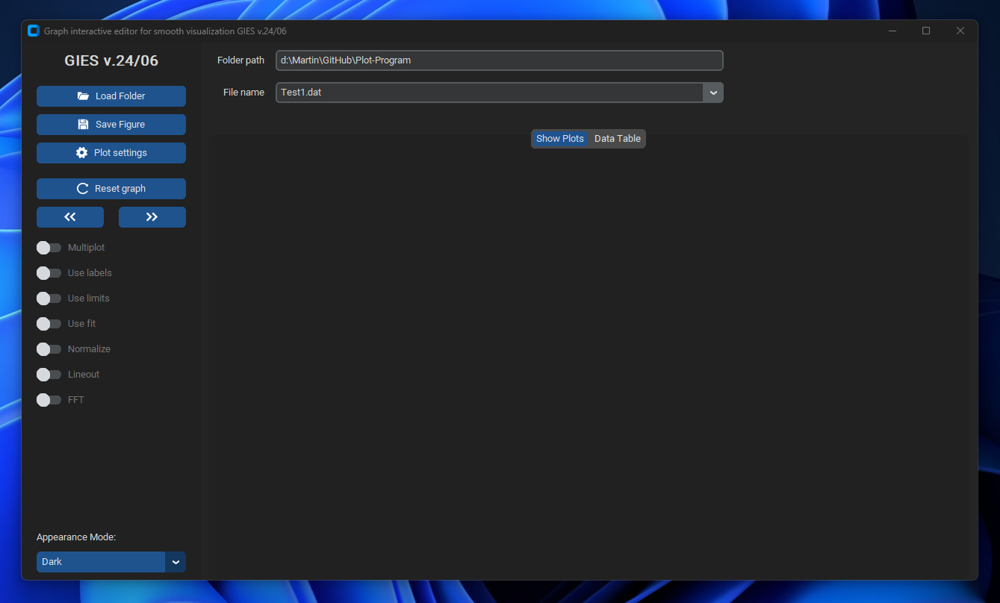
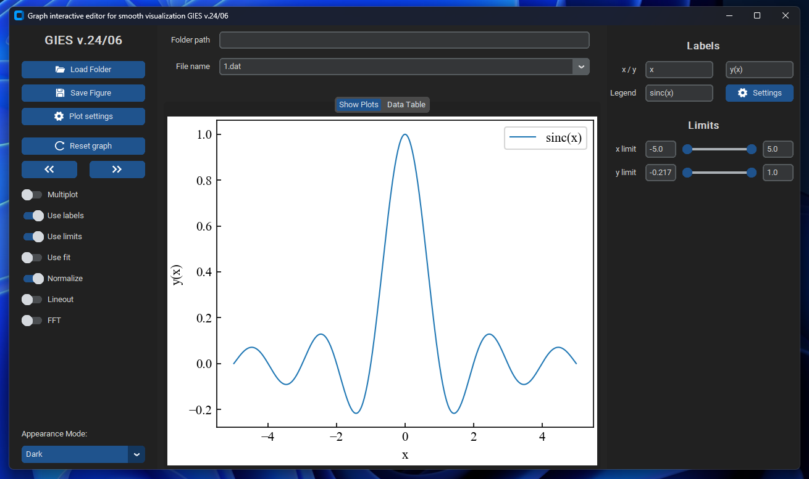
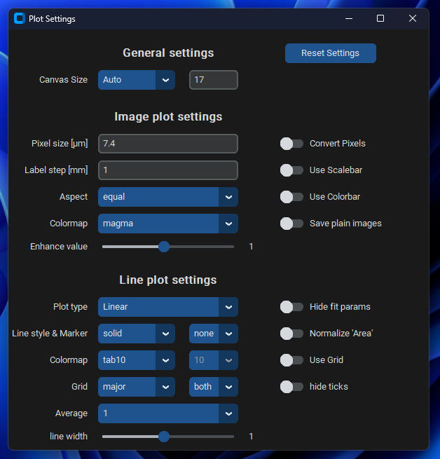
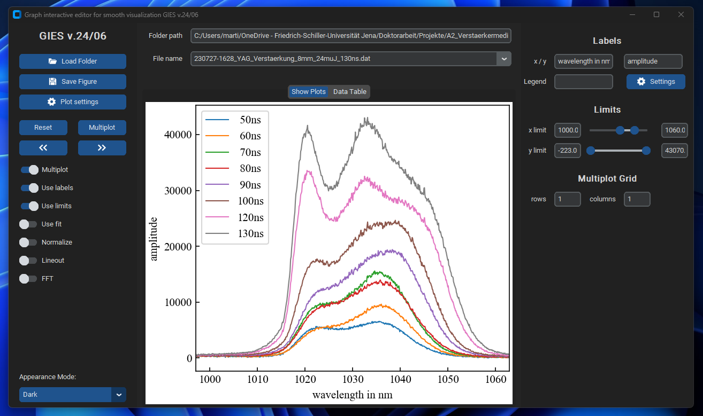
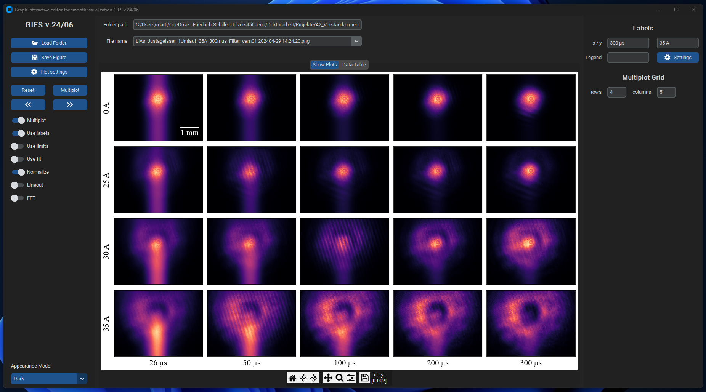
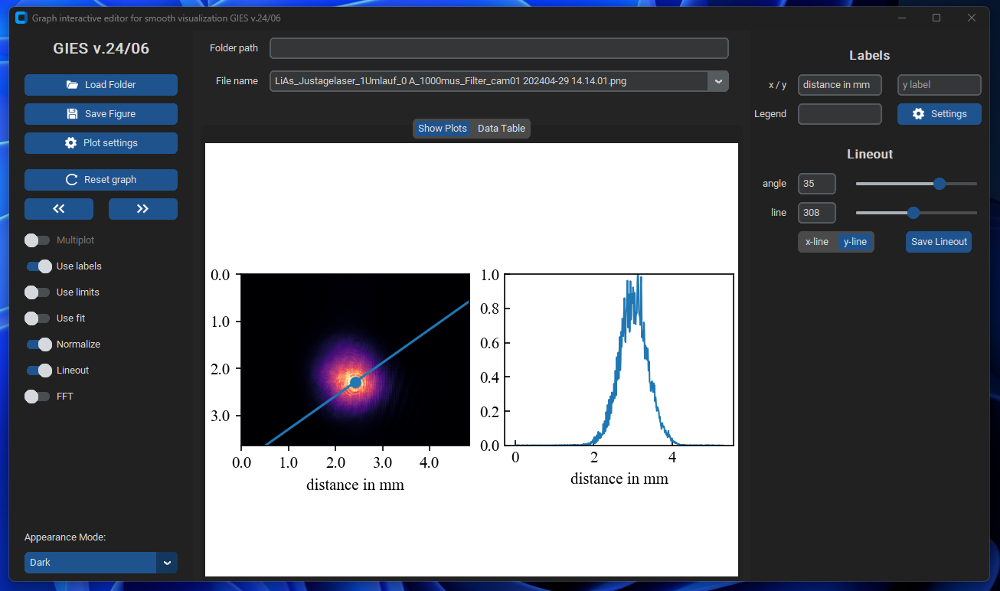
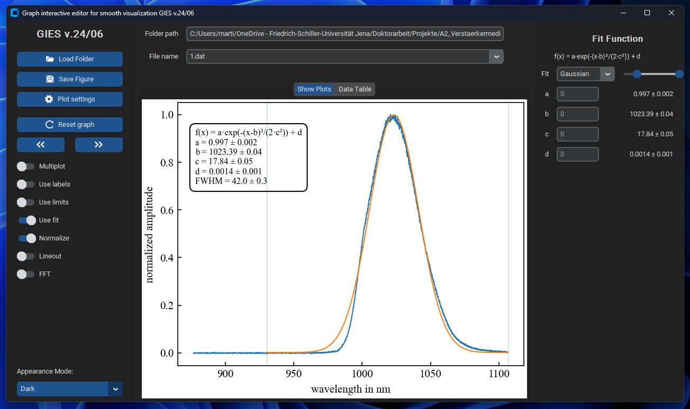

Python program for data visualization and evaluation. The working title of this program is: 

<h3>
Graph interactive editor for smooth visualization GIES v.24/06
</h3>

The program is intended to be used as a tool for a quick data visualization tool to view experimental data with (currently) one or two rows of data.

  <picture>
    <source media="(prefers-color-scheme: dark)" srcset="./documentation_images/Program_start.png">
    
  </picture>

The code is structured into several class which inherit properties of the Customtkinter package, which can be found here:

**https://github.com/TomSchimansky/CustomTkinter/tree/master**

## Main Features

### Displaying the content of data files and showing images

- It is possible to read and display the data of a text-file.
- Mathematical functions can be plotted by using numpy code notation, e.g. 'np.sinc(x)'
- Images can be displayed with different color maps. 

  <picture>
    <source media="(prefers-color-scheme: dark)" srcset="./documentation_images/Plot_mathematical_functions.png">
    
  </picture>

There are many different ways to customize the plot:
- Set x- and y-labels 
- Set a legend (either manual description or based on the file name)
- change the limits of the plot using sliders or set them via manually entering the boundaries
- Lineouts, Data fitting (see below)
- Normalize the data (different modes, e.g.  normalize maximum or integral)
- Do a Fast Fourier Transform of line data and show the absolute value squared

### Highly customizable plots

  <picture>
    <source media="(prefers-color-scheme: dark)" srcset="./documentation_images/Plot-settings.png">
    
  </picture>

- Set the aspect ratio of the image to save the image in a specific format
- Convert pixels of images to lengths by entering the pixel size 
- change the colormap of images
- Enhance the contrast for images 
- Plot type: Plot the data either linear, or logarithmically
- choose different line styles, markers and line widths
- set the colormap of the plots with sequential or differential colormaps (see https://matplotlib.org/stable/users/explain/colors/colormaps.html)
- activate a grid
- Perform a moving average to smooth the data 

### Multiple Plots in one figure

- We can choose between plotting several data sets into one plot or splitting them into different plots by specifying the number of rows and columns of the multiplot grid

  <picture>
    <source media="(prefers-color-scheme: dark)" srcset="./documentation_images/Multiplot_Line-data.png">
    
  </picture>

  <picture>
    <source media="(prefers-color-scheme: dark)" srcset="./documentation_images/Multiplot_Images.png">
    
  </picture>

### Lineouts of images
- Do a lineout of images specified by a point and an angle towards the x-axis 

  <picture>
    <source media="(prefers-color-scheme: dark)" srcset="./documentation_images/Lineout.png">
    
  </picture>

### Fits
- Fitting data with different functions (e.g. Gauß, Lorentz, Exponential, Square Root, Polynomial)

  <picture>
    <source media="(prefers-color-scheme: dark)" srcset="./documentation_images/Fit_Function.png">
    
  </picture>

